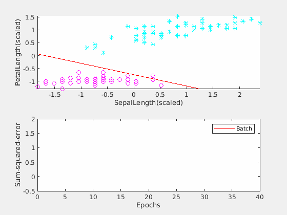
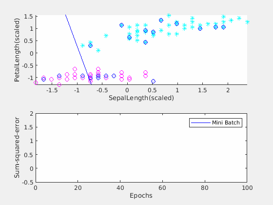
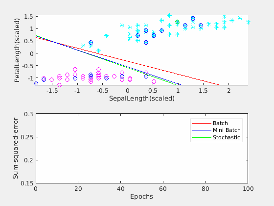
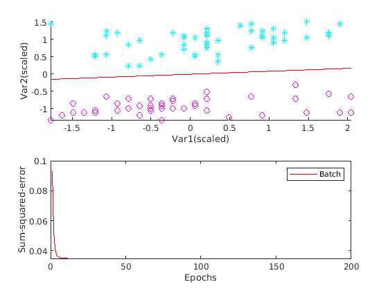
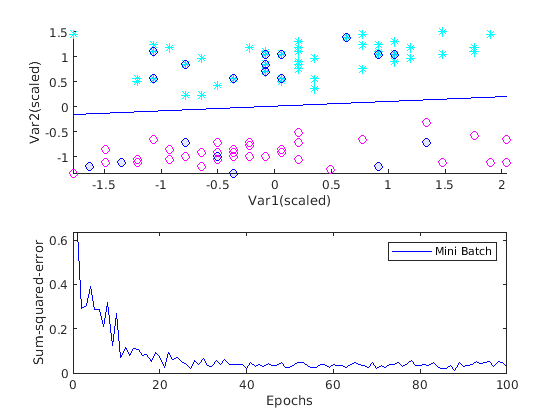
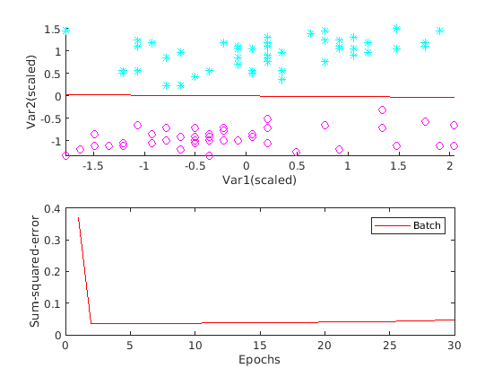
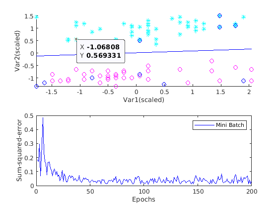
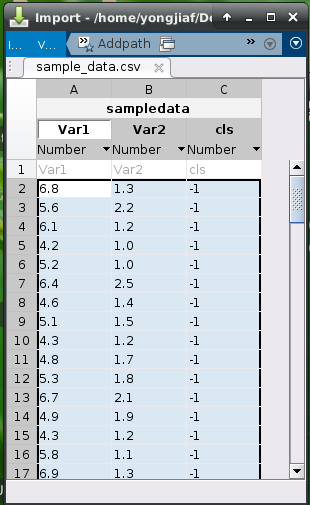

# Animated Adaptive Linear Neuron (Adaline)
[](https://www.mathworks.com/matlabcentral/fileexchange/100726-animated-adaptive-linear-neuron)

How can a machine learning model be trained to [classify flowers](https://medium.com/gft-engineering/start-to-learn-machine-learning-with-the-iris-flower-classification-challenge-4859a920e5e3)? 
The fundamental question 
behind this is how a machine learning model categorizes data like the flower pictures. 
Adaline (Adaptive Linear Neuron) is a good example for machine learning classification.

How is this related to gradient descent? [Adaline](https://en.wikipedia.org/wiki/ADALINE) starts with a 
random [decision boundary](https://en.wikipedia.org/wiki/Decision_boundary), 
and computes the cost function of it. Then gradient descent can be used to minimize the cost function and 
move the decision boundary to its optimized location.

Note if a picture is worth a thousand words, **an animation _shall_ worth more than a thousand pictures**. 
Animated Adaline is a  MATLAB&reg; class that
visualizes how an Adaline model is trained. More specifically, Animated Adaline can show how each iteration 
of gradient descent lowers down the cost function, thus moves the decision boundary at the same time. For beginners, 
this demonstrates clearly how gradient descent is used to do machine learning classification.

Please refresh the browser to restart the animation.



In the above animation, the top one is a scatter plot of some data from the iris dataset from [UCI server](https://archive.ics.uci.edu/ml/machine-learning-databases). 
The red line is the decision boundary. The lower one is a plot of the cost function of an Adaline model.

In addition to normal (batch) gradient descent, Animated Adaline also supports 
[mini batch and stochastic gradient descents](https://towardsdatascience.com/batch-mini-batch-stochastic-gradient-descent-7a62ecba642a).
For advanced deep learning users, it can be used to demonstrate the related concepts. Animated Adaline 
highlights the subgroup of data being used to do mini batch for each 
iteration of gradient descent. Users can see clearly how this subgroup affects the 
moving of the decision boundary. 



Users can even compare these three different kinds of gradient descent by animating them at the same time.



Features:
* Support batch, mini batch, and stochastic gradient descent. Plot them independently or all together 
* Plot decision boundary and cost function for each iteration of gradient descent
* Allow user to set learning rate alpha to demonstrate its impact
* Allow user to set mini batch size to see how it affects the training process 
* Allow user to use his/her own data set
* Generate animation gif for a presentation or course materials

# Get Started
See [test.m](./test.m) for simple examples for getting started quickly.

# Usage
## Instantiate
Instantiate it with the data file. Note this uses a bogus dataset included with this script.

`
ada = Adaline('sample_data.csv');
`
## Animation
If you just want to use default settings, then you can start the animation (See Example 1 in 
[test.m](./test.m))

`
ada.animate();
`



As shown above, the bogus dataset contains two categories/classes (plotted in cyan and 
in magenta in the top scatter plot). The red line in the top plot is the decision boundary. When the
training is finished, the decision boundary successfully separates the two classes.

## Mini batch gradient descent
By default, only batch gradient descent is turned on. You can use the following three member variables to 
turn on/off them individually. The following example shows the mini batch only.
```
ada = Adaline('sample_data.csv');
ada.showBatch = false;          % skip batch gradient descent
ada.showMiniBatch = true;       % show minibatch
ada.showStochastic = false;     % skip stochastic 
ada.maxSteps = 100;             % maximum iterations of gradient descent
ada.showHighLight = true;       % high light min batch samples
ada.animate();
```
The above example also show how to to stop the gradient descent by setting the maximum iteractions of gradient
descent.



The cost function plot is not as smooth as the one of the batch gradient descend, because the
optimized solution for a subgroup (the mini batch) of samples is in general not the same as
the optimized solution for the whole group. By setting the showHighLight property, the subgroup of
samples are highlighted as shown in the above screenshot of the animation. 

If you set all three gradient descents to be true, you can then generate an animation similar to the third one
from top of this page. 

## Learning rate
Set the learning rate (before calling animate).

`
ada.alpha = 0.0155;             % a big learning rate 
`

This learning rate is closed to the threshold. Bigger alpha will make the
cost function diverge. Visually the decision boundary moves away from 
the opimized location.



## Batch size
Set mini batch size by doing this

`
ada.batchSize = 10;     % smaller batch size
`



By default, mini batch size is 20. By setting a smaller size, the cost function plot oscillates more
than the Mini Batch plot above, which uses the default size of 20.

## Dataset
### included bogus dataset
A bogus [dataset](./sample_data.csv) is included for illustration purpose. It is saved in CSV format.

### Download iris dataset from UCI
A [script](./downloadprocess.m) is provided to download and process the iris dataset from UCI server. 

### Use your own data
The dataset you provided needs to be three columns. The first one is the first feature, the second one is the second feature. The third one needs to be the label. It must be either 1 or -1.
If you want to use your own dataset, save it into a format like the [bogus](./sample_data.csv) data, then 
it can be used by Animated Adaline.



